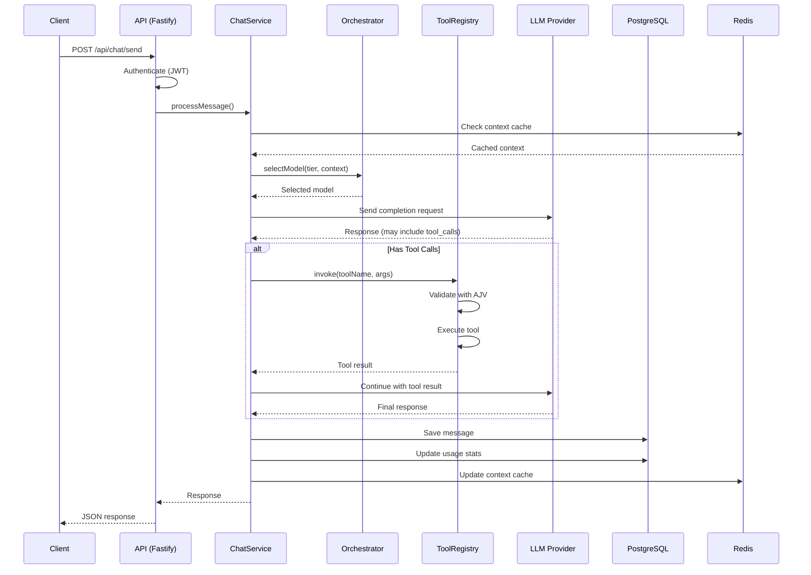
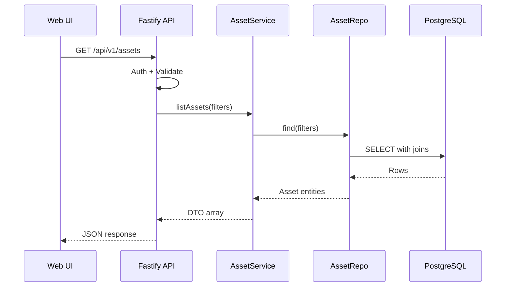
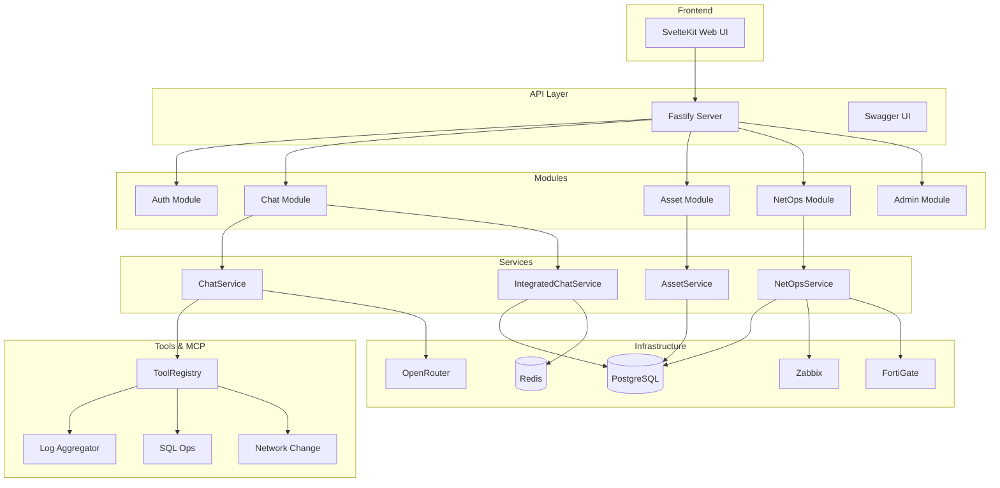

# Architecture

NetOpsAI Gateway follows Clean Architecture principles with a layered, modular design.

## Table of Contents

- [High-Level Overview](#high-level-overview)
- [Package Map](#package-map)
- [Data Flow](#data-flow)
- [Component Diagram](#component-diagram)
- [Request Flow](#request-flow)
- [Key Design Decisions](#key-design-decisions)

---

## High-Level Overview

```
┌─────────────────────────────────────────────────────────────────┐
│                         CLIENTS                                  │
│  ┌─────────┐  ┌─────────┐  ┌─────────┐  ┌─────────┐            │
│  │ Web UI  │  │   CLI   │  │   MCP   │  │ External│            │
│  │SvelteKit│  │  Node   │  │ Clients │  │   API   │            │
│  └────┬────┘  └────┬────┘  └────┬────┘  └────┬────┘            │
└───────┼────────────┼────────────┼────────────┼──────────────────┘
        │            │            │            │
        └────────────┴─────┬──────┴────────────┘
                           │
┌──────────────────────────┼──────────────────────────────────────┐
│                    PRESENTATION LAYER                            │
│  ┌───────────────────────┴───────────────────────┐              │
│  │              Fastify API Server               │              │
│  │  • REST endpoints  • Auth middleware          │              │
│  │  • Swagger/OpenAPI • Rate limiting            │              │
│  └───────────────────────┬───────────────────────┘              │
└──────────────────────────┼──────────────────────────────────────┘
                           │
┌──────────────────────────┼──────────────────────────────────────┐
│                    APPLICATION LAYER                             │
│  ┌─────────────┐  ┌─────────────┐  ┌─────────────┐              │
│  │   Chat      │  │   Asset     │  │   NetOps    │              │
│  │  Services   │  │  Services   │  │  Services   │              │
│  └──────┬──────┘  └──────┬──────┘  └──────┬──────┘              │
│         └────────────────┼────────────────┘                      │
│  ┌───────────────────────┴───────────────────────┐              │
│  │              Tool Registry (AJV)              │              │
│  └───────────────────────────────────────────────┘              │
└──────────────────────────┼──────────────────────────────────────┘
                           │
┌──────────────────────────┼──────────────────────────────────────┐
│                      DOMAIN LAYER                                │
│  ┌─────────────┐  ┌─────────────┐  ┌─────────────┐              │
│  │   Entities  │  │    Value    │  │   Domain    │              │
│  │             │  │   Objects   │  │   Events    │              │
│  └─────────────┘  └─────────────┘  └─────────────┘              │
└──────────────────────────┼──────────────────────────────────────┘
                           │
┌──────────────────────────┼──────────────────────────────────────┐
│                  INFRASTRUCTURE LAYER                            │
│  ┌─────────────┐  ┌─────────────┐  ┌─────────────┐              │
│  │  PostgreSQL │  │    Redis    │  │  External   │              │
│  │    (pg)     │  │  (ioredis)  │  │    APIs     │              │
│  └─────────────┘  └─────────────┘  └─────────────┘              │
└─────────────────────────────────────────────────────────────────┘
```

---

## Package Map

### Apps (Deployable)

| Package | Path | Description |
|---------|------|-------------|
| `@apps/api` | `apps/api` | Fastify REST API server |
| `@apps/web-ui` | `apps/web-ui` | SvelteKit frontend |
| `gateway-mcp` | `apps/gateway-mcp` | MCP protocol gateway |
| `gateway-cli` | `apps/gateway-cli` | Command-line interface |

### Domain Layer

| Package | Path | Description |
|---------|------|-------------|
| `@domain/core` | `packages/domain` | Entities, value objects, domain logic |

### Application Layer

| Package | Path | Description |
|---------|------|-------------|
| `@application/core` | `packages/application` | Use cases, services, commands |
| `@contracts/shared` | `packages/contracts` | Shared types, interfaces, DTOs |

### Infrastructure Layer

| Package | Path | Description |
|---------|------|-------------|
| `@infra/postgres` | `packages/infra-postgres` | PostgreSQL client, repositories |
| `@infra/redis` | `packages/infra-redis` | Redis cache client |
| `@infra/netdevice` | `packages/infra-netdevice` | Network device parsers |
| `@infra/vector` | `packages/infra-vector` | Vector store (embeddings) |

### Cross-Cutting

| Package | Path | Description |
|---------|------|-------------|
| `@tools/registry` | `packages/tools` | Tool definitions & registry |
| `@security/core` | `packages/security` | JWT, auth, permissions |
| `@observability/core` | `packages/observability` | Logging, metrics |
| `@config/shared` | `packages/config` | Environment configuration |
| `@testing/shared` | `packages/testing` | Test utilities |

### MCP Servers

| Package | Path | Description |
|---------|------|-------------|
| `mcp-log-aggregator` | `packages/mcp-servers/core/log-aggregator` | Log collection |
| `mcp-sql-ops` | `packages/mcp-servers/core/sql-ops` | SQL operations |
| `mcp-network-change` | `packages/mcp-servers/core/network-change` | Network changes |
| `mcp-asset-inventory` | `packages/mcp-servers/core/asset-inventory` | Asset management |
| `mcp-fortigate` | `packages/mcp-servers/core/fortigate` | FortiGate integration |
| `mcp-zabbix` | `packages/mcp-servers/core/zabbix` | Zabbix monitoring |

---

## Data Flow

### Chat Request Flow



### Asset Management Flow



---

## Component Diagram



---

## Request Flow

### HTTP Request Lifecycle

```
1. Request Received
   └─> Fastify onRequest hooks
       └─> Request ID generation (correlation ID)
       └─> Language detection (i18n)

2. Authentication
   └─> JWT verification
   └─> User context extraction

3. Validation
   └─> Route schema validation (Zod/JSON Schema)
   └─> Rate limit check

4. Handler Execution
   └─> Service layer call
   └─> Business logic
   └─> Repository operations

5. Response
   └─> Serialization
   └─> Swagger schema compliance

6. Error Handling
   └─> Centralized error handler
   └─> Structured error response
```

---

## Key Design Decisions

| Decision | Rationale |
|----------|-----------|
| No ORM (raw pg) | Full SQL control, performance, simpler migrations |
| ioredis | Best Redis client for Node.js, cluster support |
| Fastify | Fastest Node.js framework, great plugin ecosystem |
| AJV for tools | Industry standard JSON Schema validation |
| Correlation ID | Distributed tracing across services |
| Max 250 lines/file | Maintainability, focused modules |
| ESM modules | Modern Node.js, tree-shaking |
| Zod validation | Runtime type safety, TypeScript integration |

See [DECISIONS.md](DECISIONS.md) for detailed Architecture Decision Records.

---

## Next Steps

- 📊 [Data Model](DATA_MODEL.md) – Database schema
- 🔌 [API Reference](API.md) – Endpoints
- 🛠️ [Tools Guide](TOOLS.md) – Tool registry
